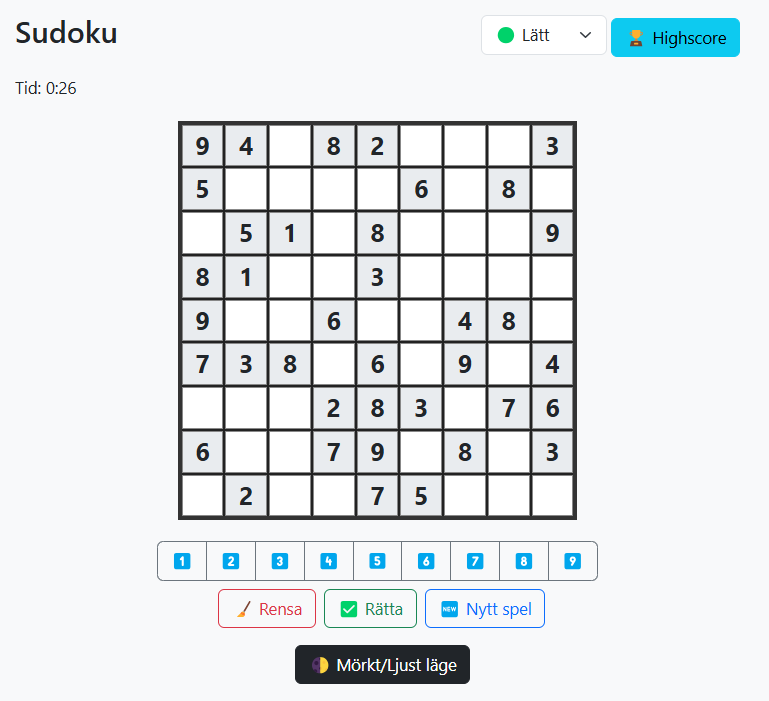

# Sudoku

Ett litet sudoku-spel för webbläsare med tre svårighetsgrader, highscore och mörkt/ljust läge.



## Funktioner
- Tre svårighetsgrader: Lätt, Medel, Svår
- Highscore-lista
- Timer
- Poängsystem baserat på tid, fel och svårighetsgrad
- Upp till fyra noteringar per ruta
- Pågående spel sparas automatiskt i webbläsaren
- Mörkt/ljust läge
- Responsiv design med Bootstrap

## Demo
Testa spelet direkt här:
🈸[Sudoku](https://htmlpreview.github.io/?https://github.com/hakimsjo/sudoku/blob/main/index.html)

## Installation
1. Klona detta repo:
   ```
   git clone https://github.com/hakimsjo/sudoku.git
   ```
2. Öppna `index.html` i din webbläsare.

Ingen installation av beroenden krävs.

## Användning
Välj svårighetsgrad, fyll i rutorna och försök lösa sudokut så snabbt som möjligt! Växla mellan Värde och Notering för att antingen fylla i en ruta eller lägga till små kandidatsiffror. Du kan byta mellan mörkt och ljust läge samt se highscore.

## Licens
MIT
